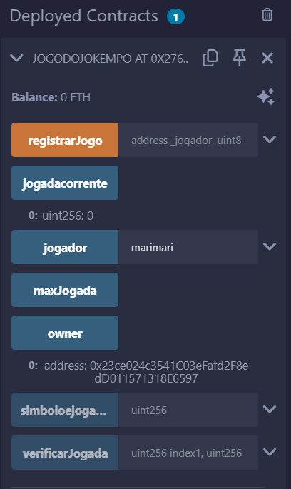

# SmartContract jogoJokenpo.sol

## Função primordial
O referido smartcontract tem a funcionalidade de simular um Jokenpô, analisar as jogas e decretar empate, vitória ou derrota e ainda estipular o dono do contrato como único acesso para modificação e inserção de informações

## Funcionalidades

### 1. Listagem de símbolos
- **Descrição:** Permite listar os 3 tipos de símbolos possíveis para se jogar
- **Código:**
  - `enum Simbolo { Pedra, Papel, Tesoura }'

### 2. Controle de Acesso
- **Descrição:** Implementa restrições para que apenas o dono do contrato possa executar determinadas funções.
- **Funções principais:**
  -  `modifier onlyOwner() { 
        require(msg.sender == owner, "Apenas o dono pode modificar");
        _;
    }
    constructor() { 
        owner = msg.sender;`

### 3. Uso de Mapping
- **Descrição:** Utiliza mappings para associar chaves a valores, permitindo consultas rápidas.
- **Exemplos:**
  - Mapping de endereços para jogadas.
  - Mapping para registrar os símbolos jogados anteriormente.
- **Funções principais:**
-   `mapping(uint256 => address) public jogador;
    mapping(uint256 => Simbolo) public simboloejogado;`

### 4. Variáveis reutilizadas
- **Descrição:** Utiliza variáveis para armazenar e setar valores primordias que serão utilizados na lógica.
- **Funções principais:**
-   `uint256 public maxJogada = 10;
    uint256 public jogadacorrente;`

### 5. Função de Registrar um Jogo
- **Descrição:** Função para receber os devidos parâmetros necessários e registrar um jogo no contrato
- **Funções principais:**
-   `function registrarJogo(address _jogador, Simbolo simbolejo) public {
        require(jogadacorrente < maxJogada, "Numero maximo de jogadas atingido");
        jogador[jogadacorrente] = _jogador;
        simboloejogado[jogadacorrente] = simbolejo;
        jogadacorrente++;
    };`

### 6. Função de Verificar uma Jogada
- **Descrição:** Função para comparar as jogas dos dois últimos jogadores e decretar quem venceu
- **Funções principais:**
-   `function verificarJogada(uint256 index1, uint256 index2) public view returns (string memory) {
        require(index1 < jogadacorrente && index2 < jogadacorrente, "Indices de jogada invalidos");
        Simbolo simbolo1 = simboloejogado[index1];
        Simbolo simbolo2 = simboloejogado[index2];
        if(simbolo1 == simbolo2) {
            return "Empate";
        }
        if ((simbolo1 == Simbolo.Pedra && simbolo2 == Simbolo.Tesoura) ||
            (simbolo1 == Simbolo.Papel && simbolo2 == Simbolo.Pedra) ||
            (simbolo1 == Simbolo.Tesoura && simbolo2 == Simbolo.Papel)) {
            return "Jogador 1 Ganhou!";
        } else {
            return "Jogador 2 Ganhou!";
        }
    }`

## Exemplo de testes no Remix IDE

<div align="center">
<sub>Figura 01</sub><br>
<br>
<sup>Fonte: Material produzido pelo autor (2025)</sup>
</div>

## Código Inteiro

```sol
// SPDX-License-Identifier: MIT
pragma solidity ^0.8.4;

contract JogoDoJokempo {
    enum Simbolo { Pedra, Papel, Tesoura }

    mapping(uint256 => address) public jogador;
    mapping(uint256 => Simbolo) public simboloejogado;
    address public owner;

    uint256 public maxJogada = 10;
    uint256 public jogadacorrente;

    modifier onlyOwner() { 
        require(msg.sender == owner, "Apenas o dono pode modificar");
        _;
    }
    constructor() { 
        owner = msg.sender;
    }

    function registrarJogo(address _jogador, Simbolo simbolejo) public {
        require(jogadacorrente < maxJogada, "Numero maximo de jogadas atingido");
        
        jogador[jogadacorrente] = _jogador;
        simboloejogado[jogadacorrente] = simbolejo;
        jogadacorrente++;
    }

    function verificarJogada(uint256 index1, uint256 index2) public view returns (string memory) {
        require(index1 < jogadacorrente && index2 < jogadacorrente, "Indices de jogada invalidos");
        
        Simbolo simbolo1 = simboloejogado[index1];
        Simbolo simbolo2 = simboloejogado[index2];

        if(simbolo1 == simbolo2) {
            return "Empate";
        }

        if ((simbolo1 == Simbolo.Pedra && simbolo2 == Simbolo.Tesoura) ||
            (simbolo1 == Simbolo.Papel && simbolo2 == Simbolo.Pedra) ||
            (simbolo1 == Simbolo.Tesoura && simbolo2 == Simbolo.Papel)) {
            return "Jogador 1 Ganhou!";
        } else {
            return "Jogador 2 Ganhou!";
        }
    }
}
```